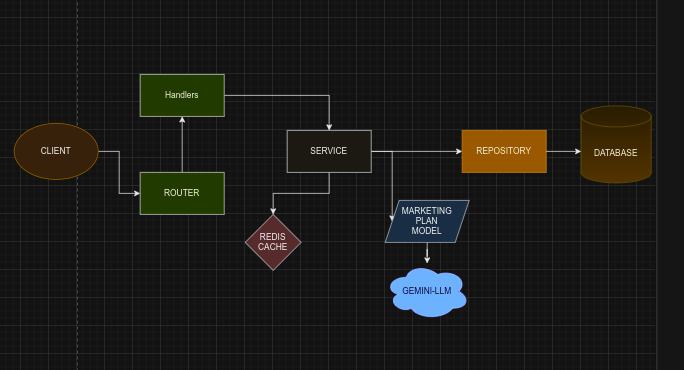

# Planify - Backend

Planify is an AI-powered platform designed to simplify the process of generating marketing plans for small businesses. The backend of Planify is built using FastAPI and Go, with AI-driven features implemented using LangChain for generating customized, actionable marketing strategies.

## Features

- AI-powered marketing plan generation using LangChain
- Customizable phases and steps for each marketing plan
- Scalable and efficient backend built with FastAPI and Go
- Secure and user-friendly system for businesses to input details and receive tailored marketing strategies

## Technologies Used

- **Go**: Backend service for handling heavy business logic.
- **LangChain**: AI model integration for generating marketing plans.
- **PostgreSQL**: Database for storing business, marketing plan, phase, and step data.
- **Docker**: For containerization of the application and its dependencies.


### Architecture

- Models: Represent the structure of products and ingredients stored in MongoDB.
- DTO (Data Transfer Objects): Used to transfer data between the service and the client.
- Handlers: HTTP request handlers for routing.
- Repositories: Manage database interaction, including querying and seeding MongoDB collections.
  Services: Business logic for processing data (e.g., analyzing ingredient risk).




#### Swagger

- GET /swagger/doc.yaml: Serve Swagger YAML documentation.
- GET /swagger/index.html: Swagger UI to interact with the API.

### Installation

1. Clone this repository:

   ```bash
   git clone https://github.com/edaywalid/devfest-batna24-backend
   cd devfest-batna24-backend
   ```

2. Run the project

   ```bash
       make start-db
       make run
   ```

### Swagger documentation

```bash
    http://localhost:8080/swagger/index.html
```